# RAG 품질 테스트 결과 리포트 (A/C 비교)

작성일: 2026-04-15  
작성 목적: 기존 기준 테스트(`a280116f-790f-42cc-bae0-653dd2a52c8b`, `4de77cb4-76d0-4be3-9158-31c037504425`)와 신규 40문항 짧은 사용자 질의 데이터셋 테스트 결과를 함께 비교하여, A/C 합성 질의 전략의 성과와 한계를 구조적으로 파악합니다.

---

## 1. 실행 개요 및 재현 조건

이번 작업에서는 관리자 GUI가 호출하는 동일 경로(`/api/admin/console/rag/tests/run`)로 신규 테스트를 실행했습니다.  
즉, 로컬 스크립트로 임의 평가 로직을 우회하지 않고 Admin Console의 실험 파이프라인(`build-memory -> eval-retrieval -> eval-answer`)을 그대로 사용했습니다.

신규 실행된 run은 아래 두 건입니다.

| 구분 | Run ID | Method | Dataset | Snapshot(Gating Batch) | 주요 설정 |
|---|---|---|---|---|---|
| 신규 A | `cfb7587d-649f-457b-9410-0948abb49772` | A | `human_eval_short_user_40` | `4af71ae8-ca74-4f0d-9071-ed7e13bee912` | `full_gating`, `selective_rewrite=true`, `threshold=0.05`, `retrieval_top_k=10`, `rerank_top_n=5` |
| 신규 C | `2a899769-613b-4463-95e1-fb850fdb73a3` | C | `human_eval_short_user_40` | `c9adc3f9-4723-4a86-876c-f808d4d0718e` | `full_gating`, `selective_rewrite=true`, `threshold=0.05`, `retrieval_top_k=10`, `rerank_top_n=5` |

비교 기준이 되는 기존 run은 아래와 같습니다.

| 구분 | Run ID | Method | Dataset(실행 당시) | Snapshot(Gating Batch) |
|---|---|---|---|---|
| 기존 A | `a280116f-790f-42cc-bae0-653dd2a52c8b` | A | 기본 평가 데이터셋(`eval_samples`, 실행 당시 140문항) | `4af71ae8-ca74-4f0d-9071-ed7e13bee912` |
| 기존 C | `4de77cb4-76d0-4be3-9158-31c037504425` | C | 기본 평가 데이터셋(`eval_samples`, 실행 당시 140문항) | `c9adc3f9-4723-4a86-876c-f808d4d0718e` |

핵심적으로 통제한 변수는 다음과 같습니다.

1. A/C 각각 동일한 snapshot을 신규/기존 비교에서 유지했습니다.
2. gating preset, rewrite, threshold, retrieval/rerank 설정을 동일하게 유지했습니다.
3. 바꾼 변수는 평가 데이터셋 성격(기본 vs 짧은 사용자 질의 40문항)입니다.

이는 `.codex/AGENTS.md`의 3.6 항목(동일 snapshot/조건 하 단일 변수 비교) 원칙을 따르는 설계입니다.

---

## 2. 평가 데이터셋 설명 (기본 eval_samples vs 신규 short-user 40)

### 2.1 기본 평가 데이터셋 (`human_eval_default`, `eval_samples`)

기본 평가 데이터셋은 원래 dev/test 140문항으로 운용되던 retrieval-aware 셋이며, 실행 당시 run(`a280...`, `4de...`)은 140문항 기준으로 수행되었습니다.  
해당 셋은 다음을 동시에 검증하도록 설계되어 있습니다.

1. 일반 설명형 질의(`general_ko`)에서 문서 grounding이 유지되는지
2. 장애/원인형 질의(`troubleshooting`)에서 회수율이 유지되는지
3. code-mixed 질의에서 토큰 혼합 입력을 잘 처리하는지
4. follow-up 질의에서 대화 문맥 의존성을 어느 정도 흡수하는지
5. 짧은 질의(`short_user`)에서도 검색 성능이 무너지지 않는지

대표 문항 유형 예시는 다음과 같습니다.

- 일반 설명형: “Spring Security에서 Authentication이 무엇이고 어떻게 동작하는가?”
- 트러블슈팅형: “XML 설정에서 schema/preamble 문제로 에러가 나는 원인은 무엇인가?”
- code-mixed형: “@Conditional annotation과 @Bean 등록 순서가 충돌할 때 조건 판정은 어떻게 되는가?”
- follow-up형: “앞 문맥을 전제로 @MatrixVariable 다중값 매핑을 어떻게 처리하는가?”
- 짧은 질의형: “JNDI 조회 preamble 뭐임?”

### 2.2 신규 평가 데이터셋 (`human_eval_short_user_40`)

신규 데이터셋은 **짧은 실제 사용자 질의 스타일**을 집중 평가하기 위한 40문항 전용 셋으로 구성했습니다.  
스키마는 기존 eval 샘플과 동일하게 유지했습니다.

- 필드 구조 동일: `sample_id`, `split`, `user_query_ko`, `expected_doc_ids`, `expected_chunk_ids`, `expected_answer_key_points`, `query_category`, `difficulty`, `single_or_multi_chunk`, `source_product`, `source_version_if_available`
- 분포: `short_user` 40문항(단일 청크 34, 멀티 청크 6)
- 소스 분포: `spring-framework` 24, `spring-security` 16

대표 문항은 아래처럼 짧고 구어체에 가깝게 구성했습니다.

- “XML JNDI 어디서 설정함?”
- “@Configuration @Autowired 설정 우선순위 어케됨?”
- “WebFlux @MatrixVariable 기본값 뭐임?”
- “DataSourceTransactionManager JDBC 기본값 뭐임?”
- “트랜잭션 왜 안됨?”

이 데이터셋의 목적은 “짧은 입력 + 생략된 문맥 + 의도 압축” 상황에서 A/C 방식이 얼마나 견고한지 분리 관찰하는 것입니다.

---

## 3. 결과 요약 (A/C 성능 비교)

### 3.1 Retrieval 핵심 지표

#### 기본 평가 데이터셋(기존 run)

| Method | Run ID | Recall@5 | Hit@5 | MRR@10 | nDCG@10 | Rewrite 채택률 |
|---|---|---:|---:|---:|---:|---:|
| A | `a280...` | 0.2036 | 0.2214 | 0.1531 | 0.1939 | 0.6429 |
| C | `4de7...` | 0.1821 | 0.2000 | 0.1442 | 0.1981 | 0.6571 |

해석:

1. 기본셋에서는 A가 Recall/Hit/MRR에서 우세했습니다.
2. C는 nDCG@10이 근소하게 높아 상위 랭크 품질의 일부 구간에서 장점이 있었습니다.
3. 두 방식 모두 rewrite 채택률이 64~66%로 높게 유지되었습니다.

#### 신규 short-user 40 데이터셋(신규 run)

| Method | Run ID | Recall@5 | Hit@5 | MRR@10 | nDCG@10 | Rewrite 채택률 |
|---|---|---:|---:|---:|---:|---:|
| A | `cfb7...` | 0.0750 | 0.0750 | 0.0762 | 0.1344 | 0.7000 |
| C | `2a89...` | 0.1250 | 0.1250 | 0.0705 | 0.1304 | 0.8000 |

해석:

1. short-user 셋에서는 C가 Recall/Hit에서 A 대비 +0.05p 높았습니다.
2. 반대로 MRR/nDCG는 A가 근소하게 높았습니다.
3. 즉, C는 “찾아내는 범위(coverage)”에 유리했고, A는 “상위 랭크 정렬”에서 소폭 유리했습니다.

### 3.2 시각 비교 (막대 그래프)

```mermaid
xychart-beta
    title "기본 데이터셋 Retrieval 지표 (A vs C)"
    x-axis ["Recall@5","Hit@5","MRR@10","nDCG@10"]
    y-axis "Score" 0 --> 0.25
    bar "A" [0.2036,0.2214,0.1531,0.1939]
    bar "C" [0.1821,0.2000,0.1442,0.1981]
```

```mermaid
xychart-beta
    title "Short-user 40 Retrieval 지표 (A vs C)"
    x-axis ["Recall@5","Hit@5","MRR@10","nDCG@10"]
    y-axis "Score" 0 --> 0.16
    bar "A" [0.0750,0.0750,0.0762,0.1344]
    bar "C" [0.1250,0.1250,0.0705,0.1304]
```

### 3.3 Answer-level 지표

| 구분 | Grounding | Answer Relevance | Faithfulness | Hallucination Rate | Correctness |
|---|---:|---:|---:|---:|---:|
| 기존 A | 1.0000 | 0.1100 | 0.0479 | 0.0000 | 0.0000 |
| 기존 C | 1.0000 | 0.1157 | 0.0428 | 0.0000 | 0.0000 |
| 신규 A | 1.0000 | 0.1813 | 0.0425 | 0.0000 | 0.0000 |
| 신규 C | 1.0000 | 0.1630 | 0.0340 | 0.0000 | 0.0000 |

관찰:

1. Grounding 1.0, Hallucination 0.0이 전 구간 동일하게 나오고 있습니다.
2. Correctness가 전부 0.0으로 고정되어 있어 현재 answer evaluator의 기준/프롬프트/키포인트 매핑이 과도하게 엄격하거나 미스얼라인 상태일 가능성이 큽니다.
3. short-user 셋에서는 오히려 answer relevance가 높아졌지만, retrieval 절대치(Recall/MRR)는 낮아져 지표 간 불일치가 보입니다.

---

## 4. A/C 방식별 성과와 한계 (데이터셋별)

### 4.1 기본 데이터셋에서의 A/C

기본 데이터셋에서는 A가 전반 retrieval 지표에서 우세했고, C는 nDCG에서만 소폭 우세했습니다.  
특히 기본셋 내 short_user 카테고리(기존 run 내부 category summary)에서도 A가 C 대비 높은 수치를 보였습니다.

- 기존 A short_user: Recall@5 0.25, MRR@10 0.1722
- 기존 C short_user: Recall@5 0.15, MRR@10 0.1071

즉, “기본셋 내부의 short_user 샘플” 기준으로는 A가 더 강했습니다.

### 4.2 신규 short-user 40에서의 A/C

신규 short-user 40에서는 양상이 바뀌었습니다.

1. C는 Recall/Hit가 유의미하게 상승(0.125 vs 0.075)했습니다.
2. A는 MRR/nDCG가 근소하게 높았습니다.
3. C의 rewrite 채택률이 80%로 A(70%)보다 적극적이었습니다.

이는 C가 short query에서 rewrite를 더 공격적으로 적용해 top-5 내 적중을 늘렸지만, top-1~top-3 정렬 품질까지 개선되지는 못한 패턴으로 해석할 수 있습니다.

### 4.3 왜 이런 차이가 났는가 (연구 관점 해석)

AGENTS 연구 맥락에서 보면 다음 요인이 유력합니다.

1. **Snapshot 메모리 크기 불균형**: A snapshot 메모리 엔트리 127, C snapshot 47로 절대량 차이가 큽니다.
2. **임베딩 특성**: 현재 hash-embedding 기반에서 짧은 구어체 질의는 토큰 정보량이 적어 상위 랭킹 안정성이 떨어질 수 있습니다.
3. **C 질의 특성**: C는 의미 중심 구조화가 강해 rewrite 채택은 잘 되지만, 짧은 질의에서는 lexical anchor가 약해 MRR 이득이 제한될 수 있습니다.
4. **리라이트 의존성**: 신규 셋에서 C는 `delta_above_threshold` 32/40으로 채택이 매우 높습니다. 채택 자체는 늘었지만 랭킹 품질 개선은 제한적입니다.

---

## 5. Query Rewrite 활용도 분석 (Raw Query 대비)

아래는 `rag_test_result_detail.metric_contribution` 기준 집계입니다.

| Run | 샘플 수 | rewrite_applied | 채택률 | MRR 개선 샘플 | 동일 MRR | 악화 MRR |
|---|---:|---:|---:|---:|---:|---:|
| 기존 A | 140 | 90 | 64.3% | 43 | 97 | 0 |
| 기존 C | 140 | 92 | 65.7% | 41 | 99 | 0 |
| 신규 A | 40 | 28 | 70.0% | 10 | 30 | 0 |
| 신규 C | 40 | 32 | 80.0% | 11 | 29 | 0 |

핵심 해석:

1. 신규 셋에서 A/C 모두 rewrite 채택률은 올라갔습니다.
2. 그러나 “MRR 실개선 샘플 비율”은 신규셋에서 오히려 높지 않습니다(A 25%, C 27.5%).
3. 즉, 현재 selective rewrite는 “안전하게 악화를 막는 것”에는 성공했지만, “상위 랭크 강한 개선”까지는 아직 부족합니다.

rewrite 사유 분포도 일관됩니다.

- 신규 A: `delta_above_threshold` 28, `delta_below_threshold` 12
- 신규 C: `delta_above_threshold` 32, `delta_below_threshold` 8
- 신규셋에서는 `candidate_same_as_raw`가 0으로, 최근 no-op 차단 로직이 실제로 동작했습니다.

---

## 6. 현재 1차 테스트 결과 기준 문제점

### 6.1 정량적으로 확인된 문제

1. short-user 환경에서 retrieval 절대 성능이 크게 낮습니다.
2. answer correctness가 전 run에서 0.0으로 고정됩니다.
3. 기본 데이터셋이 auto-sync 특성 때문에 최신 시점에는 180문항으로 변했습니다.

### 6.2 설계/운영 리스크

1. `human_eval_default`는 `eval_samples` 전체 동기화 방식이므로, 새로운 샘플 추가 시 과거 run과 직접 비교가 흔들릴 수 있습니다.
2. snapshot별 memory 규모 차이가 커서 A/C 비교 시 “방법 효과”와 “메모리 양 효과”가 혼재될 수 있습니다.
3. short-user 질의는 문맥 축약이 심해 token anchor가 약하고, 현재 임베딩/재랭킹 조합에서 상위 랭크 안정성이 낮아집니다.

---

## 7. 개선 방안 (합성 질의 생성 / 게이팅 / 임베딩 / 재작성)

### 7.1 합성 질의 생성 개선

1. 청크당 생성 질문 수를 낮추고(예: `avg_queries_per_chunk` 조정), 유사도 기반 중복 제거를 강화해야 합니다.
2. short-user 전용 생성 템플릿(의문형 압축/생략형 표현)을 별도 버전으로 분리해야 합니다.
3. A/C 각각에 대해 짧은 질의 전용 prompt asset을 두고 ablation을 수행해야 합니다.

### 7.2 퀄리티 게이팅 개선

1. 현재 결과는 `full_gating` 기준만 있으므로, 반드시 `ungated`/`rule_only`와 동일 데이터셋 비교를 추가해야 합니다.
2. short query는 길이 기반 룰에 취약하므로 rule filter 임계치를 별도 프로파일로 분리하는 것이 필요합니다.
3. utility 점수에서 “짧은 질의의 의미 보존” 가중치를 별도 항목으로 도입해야 합니다.

### 7.3 임베딩/검색 개선

1. 현재 hash embedding 대신 의미 보존력이 높은 임베딩 모델 교체 실험이 필요합니다.
2. C 방식 질의는 의미 중심이라 lexical 신호가 약해질 수 있으므로, hybrid retrieval(BM25 + dense) 결합이 유효합니다.
3. rerank 입력 프롬프트에 short-user 질의 특성을 명시해 top-N 재정렬 안정성을 보완해야 합니다.

### 7.4 Query Rewrite 개선

1. 채택률 자체보다 “채택 후 MRR 실개선 비율”을 목표 지표로 두는 것이 맞습니다.
2. confidence delta만이 아니라 “랭킹 예상 이득”을 포함한 다중 기준 채택 로직이 필요합니다.
3. rewrite candidate 다양성이 낮을 때는 재작성 대신 raw 유지를 강화해야 합니다.

---

## 8. 테스트 데이터셋 측면의 미비점과 보완 방향

현재 신규셋(40문항)은 short-user 집중 관찰에는 유효하지만, 다음이 부족합니다.

1. follow-up/멀티턴 short-user 케이스가 부족합니다.
2. 멀티청크 비율이 15%(6/40)로 낮아 복합 추론 성능 검증이 약합니다.
3. “애매한 사용자 표현(은어/축약/오타)” 유형이 부족합니다.

보완 제안:

1. short-user 2차셋을 80~120문항으로 확장합니다.
2. 멀티청크 비율을 30% 이상으로 높여 복합 추론을 강제합니다.
3. 의도 분포를 명시적으로 설계합니다.
4. 의도 분포 예: 장애원인형, 설정위치형, 개념요약형, 비교형, 코드적용형, 후속질문형.

---

## 9. 결론 요약

이번 비교에서 확인된 핵심은 다음과 같습니다.

1. **기본 데이터셋(기존 run)**에서는 A가 retrieval 전반에서 우세, C는 nDCG만 근소 우세였습니다.
2. **신규 short-user 40**에서는 C가 Recall/Hit에서 우세했지만, A가 MRR/nDCG에서 근소 우세했습니다.
3. 두 방식 모두 rewrite 채택률은 높지만, “채택 대비 상위 랭크 실개선”은 제한적입니다.
4. correctness 0.0 고정, default dataset drift(140 -> 180), snapshot memory 불균형(127 vs 47)은 우선 해결해야 할 구조적 이슈입니다.

따라서 2차 실험은 아래 순서가 권장됩니다.

1. short-user 전용 데이터셋 확대(멀티청크/후속질문 보강)
2. ungated/rule_only/full_gating 3조건 비교 추가
3. 임베딩 모델 교체 + hybrid retrieval 실험
4. rewrite 채택 목표를 “채택률”이 아닌 “실개선율” 중심으로 재정의

---

## 부록: 수집 데이터

- 정량 원본: `docs/report/rag_eval_short_user_40_data_2026-04-15.json`
- 신규 데이터셋 원본: `data/eval/human_eval_short_user_test_40.jsonl`

